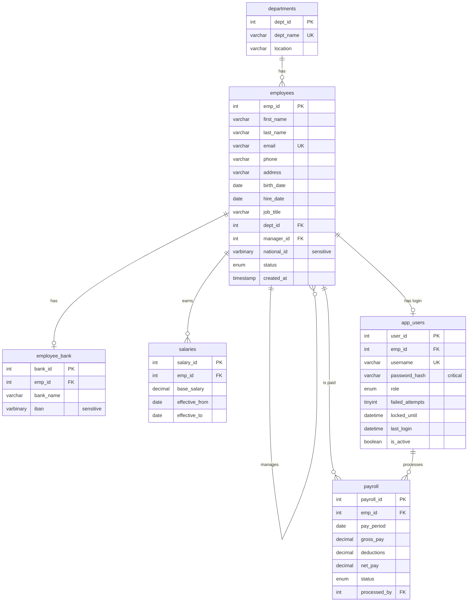

# Entity Relationship Diagram: payroll_db

```mermaid
erDiagram
    departments ||--o{ employees : "has"
    employees ||--o{ employees : "manages"
    employees ||--o| employee_bank : "has"
    employees ||--o{ salaries : "earns"
    employees ||--o{ payroll : "is paid"
    employees ||--o| app_users : "has login"
    app_users ||--o{ payroll : "processes"

    departments {
        int dept_id PK
        varchar dept_name UK
        varchar location
    }
    employees {
        int emp_id PK
        varchar first_name
        varchar last_name
        varchar email UK
        varchar phone
        varchar address
        date birth_date
        date hire_date
        varchar job_title
        int dept_id FK
        int manager_id FK
        varbinary national_id "sensitive"
        enum status
        timestamp created_at
    }
    employee_bank {
        int bank_id PK
        int emp_id FK
        varchar bank_name
        varbinary iban "sensitive"
    }
    salaries {
        int salary_id PK
        int emp_id FK
        decimal base_salary
        date effective_from
        date effective_to
    }
    payroll {
        int payroll_id PK
        int emp_id FK
        date pay_period
        decimal gross_pay
        decimal deductions
        decimal net_pay
        enum status
        int processed_by FK
    }
    app_users {
        int user_id PK
        int emp_id FK
        varchar username UK
        varchar password_hash "critical"
        enum role
        tinyint failed_attempts
        datetime locked_until
        datetime last_login
        boolean is_active
    }
```
